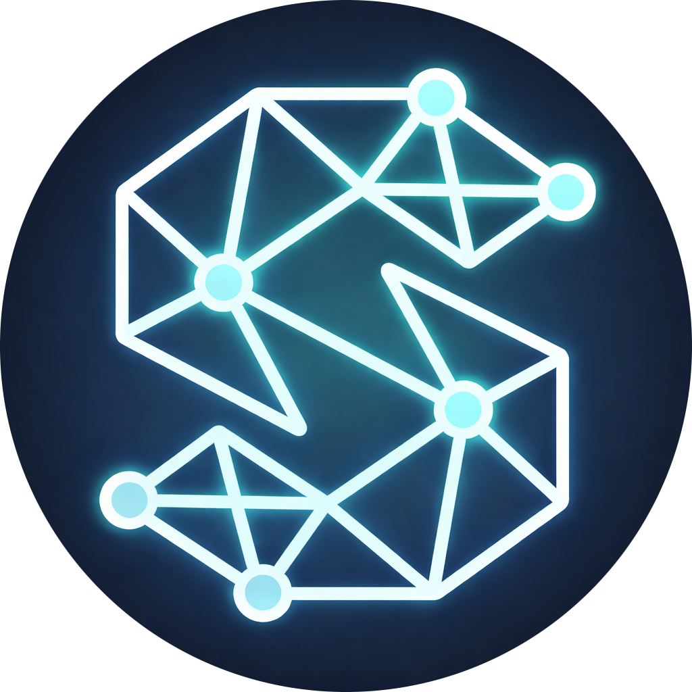
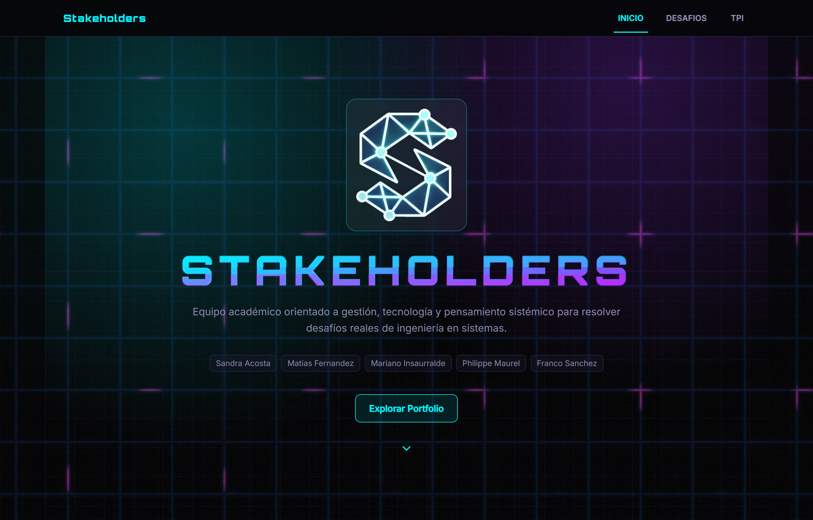

<div align="center">



# Stakeholders

**Portfolio Académico · Gestión Gerencial y de Sistemas de Información**

[](https://nextjs.org/)
[](https://react.dev/)
[](https://www.typescriptlang.org/)
[](https://tailwindcss.com/)
[](https://threejs.org/)

</div>

---

<div align="center">



*Micrositio académico con estética cyberpunk y experiencias interactivas.*

</div>

---

## ✨ Características Destacadas

🎯 **Desafíos Gerenciales** — 8 desafíos resueltos con evidencias, herramientas y reflexiones de equipo

🗺️ **Mapa Conceptual** — Visualización integral de las 7 unidades de la materia y sus interrelaciones

🤖 **RPA** — Rutas personales de aprendizaje por cada integrante

📊 **Insights** — Dashboard interactivo con métricas de progreso, evidencias y diversidad de herramientas

📋 **TPI** — Trabajo Práctico Integrador: diagnóstico y diseño organizacional de ECOM Chaco S.A.

🎨 **Diseño Cyberpunk** — Estética futurista con shaders WebGL, animaciones y tipografías custom

---

## 🚀 Quick Start

```bash
# Instalar dependencias
bun install

# Iniciar servidor de desarrollo
bun run dev
```

La app inicia en **[http://localhost:3000](http://localhost:3000)**.

---

<div align="center">

Ingeniería en Sistemas de Información · Universidad Tecnológica Nacional · 2026

</div>
